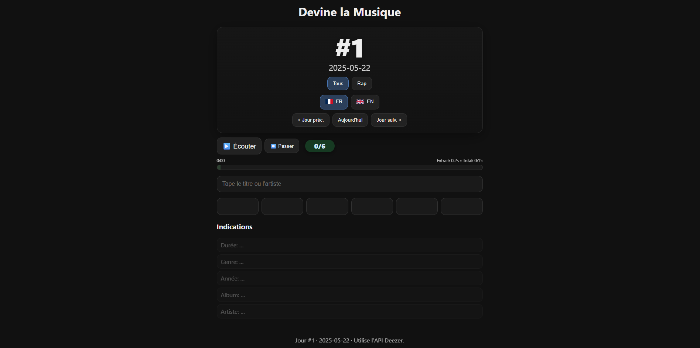

> **⚠️ Disclaimer: I used AI tools (Copilot / LLMs) heavily during development (way more than usual / expected)** 
> *(and it's scary how well it works, as my knowledge in React/Next.js is quite limited 🥲)*

# 🎵 Devine la Musique

A daily music-guessing web game. Listen to a short preview, guess the song (title + artist). Each failed attempt reveals another hint and a slightly longer audio snippet.

---

The website is available [here](https://devinelamusique-148b97606f78.herokuapp.com/) (I might change the hosting service and buy a domain later)

---

## Explanation

- Daily game (Wordle-like): one song per day, navigate previous/next days.
- FR / EN modes, progress saved locally per day & language.
- Uses Deezer previews + search for suggestions.
- Config in `lib/config.ts`.

---

## Features

- Daily song selection driven by configurable playlists (FR / EN / rap variants).
- Snippet durations increase per attempt (configurable: `SNIPPET_SECONDS` in `lib/config.ts`).
- Local per-day save state (localStorage).
- Search suggestions via the Deezer API (`/api/search`).
- Small server-side helpers: `/api/daily`, `/api/songs` (aggregation), `/api/search`.

## API Routes
- `GET /api/daily?n=<day>&lang=<fr|en|all>&genre=<all|rap>` : returns the day's song, index and date.
- `GET /api/songs?lang=<fr|en|all>` : aggregated songs from configured sources (cached).
- `GET /api/search?q=<query>&limit=<n>` : search suggestions (Deezer).

---

## Tech stack

- Next.js 14 (App Router)
- TypeScript
- React hooks + SWR for client-side data
- Deezer public API for previews & search